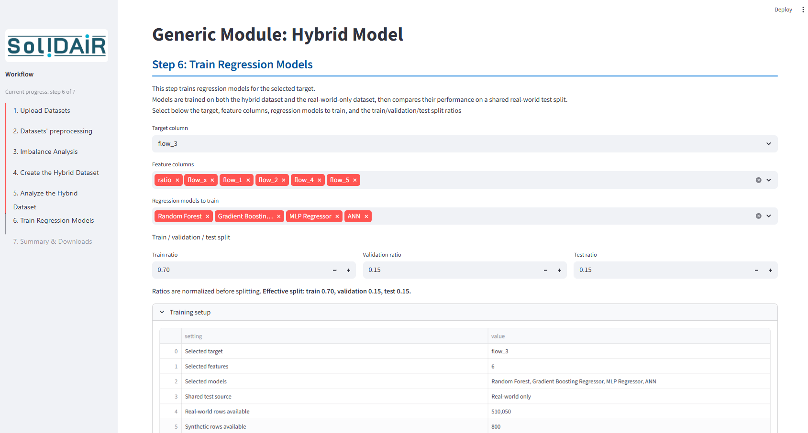
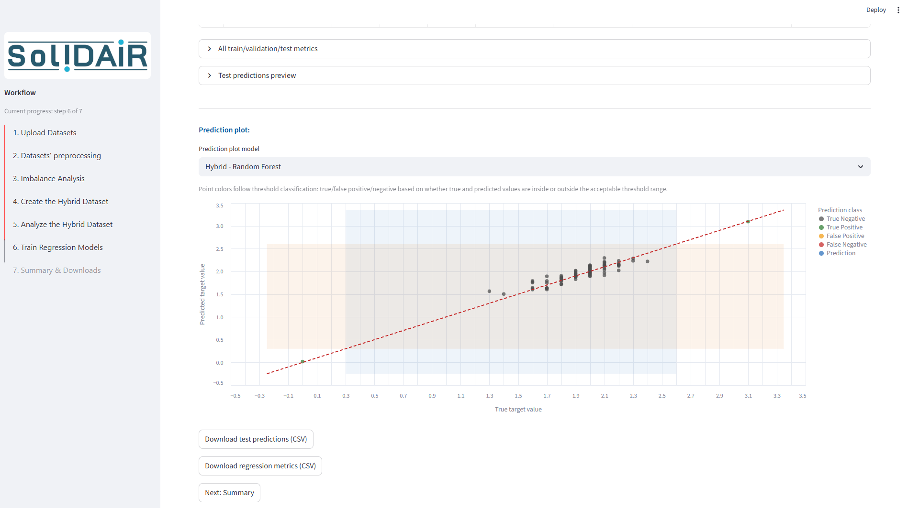

# Hybrid model approach application

Streamlit app for a simple and rapid evaluation of the hybrid model approach. Create the hybrid dataset, from real-world and synthetic data, and evaluate its contribution to prediction performance.

The app supports:

- Uploading real-world and synthetic datasets
- Optional feature dropping, feature selection, and custom feature-name mapping
- Matching checks for common/unique features and dtype mismatches before merging
- Imbalance analysis with user-defined thresholds on a selected target feature
- Creating, balancing, previewing, and downloading a hybrid dataset
- Comparing real-world and synthetic distributions for selected numeric features
- Training regression models and comparing hybrid vs real-world-only training; ANN/PyTorch support is optional
- Downloading summaries, metrics, predictions, and trained model artifacts

<p align="center">
  
  
</p>

## Upload constraints

- Max single file size: **200 MB**
- Supported upload types: `.csv`, `.txt`, `.tsv`, `.parquet`

## Privacy and security

Uploaded datasets are processed in memory during the Streamlit session and are not intentionally persisted by the app. Generated downloads, such as hybrid datasets, metrics, predictions, and model artifacts, are created only when requested by the user.

Do not upload confidential, personal, export-controlled, or otherwise sensitive data to shared or public deployments unless you control the deployment environment and have confirmed that doing so is permitted by your organization and applicable regulations.

## Expected dataset schema

The app is designed for two tabular datasets that describe comparable observations from different sources:

- **Real-world dataset:** measured production, experimental, or process data.
- **Synthetic dataset:** simulated or generated data representing the same process, product, or system.

At a generic level, both datasets should follow these expectations:

- Each row represents one observation, sample, run, part, experiment, or simulation case.
- Columns represent features, process parameters, sensor values, targets, or outputs.
- The app keeps common feature names when merging; source-specific columns that are not shared are dropped from the merge-ready dataset unless they are mapped first.
- If equivalent columns have different names, use Step 2 custom feature mapping to rename synthetic columns to their matching real-world feature names.
- Regression training requires at least one numeric target column and one or more numeric feature columns.
- Imbalance analysis requires a numeric target feature and user-defined lower and upper thresholds. These thresholds define which observations are inside or outside the acceptable range.
- Optional feature selection ranks numeric real-world features against a selected numeric target, then lets you keep a selected subset before matching and merging.
- Missing or non-numeric values in selected target/features are dropped for analyses or training steps that require numeric data.

Recommended minimal structure:

```text
real_world_dataset
├── target_numeric_column
├── feature_1
├── feature_2
└── ...

synthetic_dataset
├── target_numeric_column          # same name, or mapped to this name
├── feature_1                      # same name, or mapped to this name
├── feature_2
└── ...
```

## Sample datasets

Real-world data from a production process and synthetic data from a simulation model of the production process available here: https://doi.org/10.5281/zenodo.22300180

## Recommended Docker run

Docker is the easiest setup for users who only want to run the app. It does not require a local Python environment. The default Docker image installs the base dependency set only, so ANN/PyTorch support is not included.

```bash
docker compose up --build
```

Open http://localhost:8502

Stop the container:

```bash
docker compose down
```

### Running on a remote server

If Docker is running on a remote machine, `localhost` in your browser refers to your local computer, not the remote server. Use SSH port forwarding from your local computer:

```bash
ssh -L 8502:localhost:8502 your_user@your_server
```

Then open locally:

```text
http://localhost:8502
```

## Local development with uv

Use this workflow when editing code directly on the host machine.

1. Install `uv` if needed: https://docs.astral.sh/uv/

2. Create/update the local development environment:

```bash
uv sync
```

3. Run the app locally:

```bash
uv run streamlit run app.py
```

Open http://localhost:8502 manually in your browser. Automatic browser opening is disabled so local runs work cleanly in WSL environments, where gio open may not support localhost URLs.

## Optional ANN support

PyTorch is intentionally excluded from the default dependencies. The ANN model is hidden in the app unless PyTorch is installed.

To enable ANN training, install PyTorch separately in the environment where you run the app, following the official PyTorch installation instructions: https://pytorch.org/get-started/locally/

PyTorch and any packages it installs retain their own licenses. Review third-party dependency licenses before redistributing an environment or image that includes PyTorch.

## Environment separation

This repository intentionally separates host and container environments:

- Host development environment: `.venv`, created by `uv sync`
- Container runtime environment: `/opt/venv`, created during Docker build

Do not run `uv sync` or `uv run` with `sudo` on the host. If `.venv` becomes owned by `root`, remove it and recreate it as your normal user:

```bash
sudo rm -rf .venv
deactivate 2>/dev/null || true
unset VIRTUAL_ENV
uv sync
```

## Reproducibility

`uv.lock` is included in the Docker build and local setup. Docker uses:

```bash
uv sync --frozen --no-dev
```

This keeps container dependencies aligned with the locked project environment.

## Acknowledgements
The project SoliDAIR is funded by the European Union. Views and opinions expressed are however those of the author(s) only and do not necessarily reflect those of the European Union or the European Commission. Neither the European Union nor the granting authority can be held responsible for them. 
The publication was written at Virtual Vehicle Research GmbH in Graz and partially funded within the COMET K2 Competence Centers for Excellent Technologies by the Austrian Federal Ministry for Innovation, Mobility and Infrastructure (BMIMI), Austrian Federal Ministry for Economy, Energy and Tourism (BMWET), the Province of Styria (Dept. 12) and the Styrian Business Promotion Agency (SFG). The Austrian Research Promotion Agency (FFG) has been authorised for the programme management.

## Contact person
Sophia Bastidas \
email: Sophia.Bastidas@v2c2.at